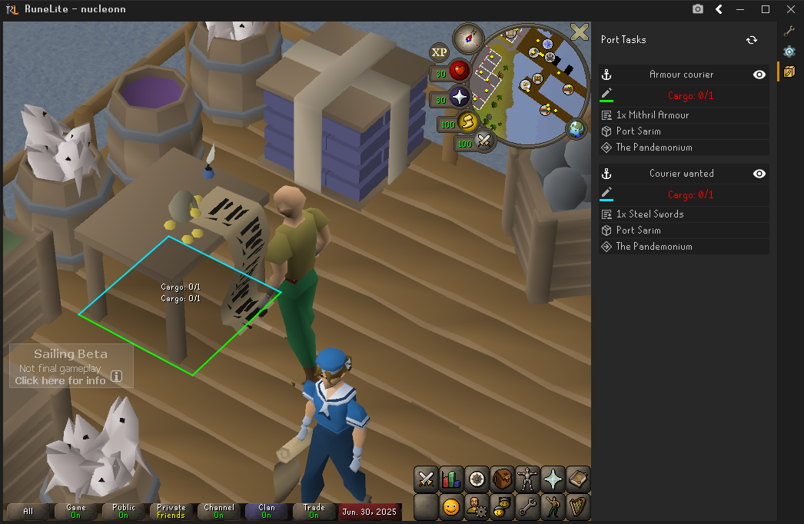
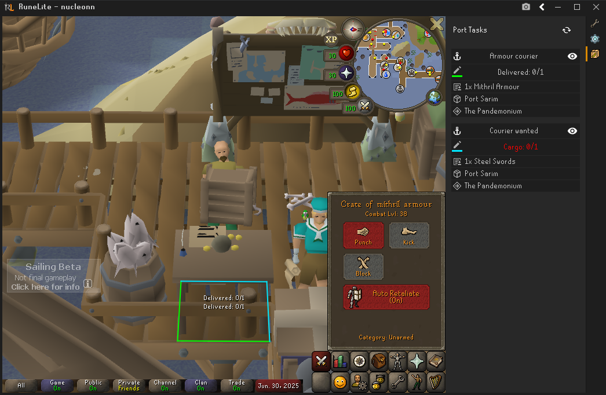

# Port Tasks

Tired of getting lost between ports? With support for over 70 courier tasks in the Sailing Beta, delivering pirate looty in the high seas of Old School RuneScape has never been easier.

Hey, Forgetting Cargo? This plugin automatically tracks your current Port Tasks!

We understand you can't always look at the panel, so this plugin also helps you find the ledgers, they are always hiding.

 

You can follow navigation overlays on the world map.

They are also displayed in world.

 
by nucleon & coopermor
 
